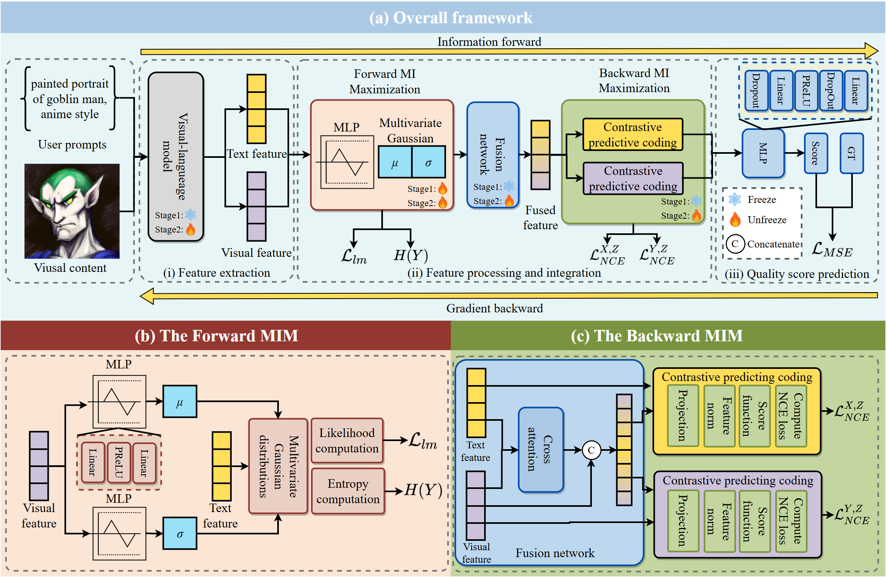

# CMIM-AIGIQA: the Cycle Mutual Information Maximization for AI-Generated Image Quality Assessment

> **ECCV 2026** | [Paper](#) | [Supplementary](#)

---------------

## Overview

**CMIM-AIGIQA** is an image quality assessment (IQA) framework for AI-generated images. It leverages the cycle mutual information maximization (CMIM) between visual and textual features to learn compact, information-rich representations for both the quality and the alignment (consistency) prediction. The CMIM-AIGIQA is built on the pretrained [ImageReward](https://github.com/THUDM/ImageReward) BLIP backbone, and achieves superior alignment SRCC on AGIQA-3k, AIGCIQA2023, and PKU-AIGIQA-4k (text-to-image part) databases while maintaining competitive quality SRCC results. 

<p align="center">
  
</p>

### Key Components

| Module | File | Description |
|--------|------|-------------|
| **CMIM** | `model.py` | Main model with BLIP backbone |
| **MMILB** | `modules/encoders.py` | Forward MIM with Gaussian assumption |
| **CPC** | `modules/encoders.py` | Backward MIM via Noise Contrastive Estimation |
| **ImageTextRegression** | `model.py` | Cross-attention fusion module and MLP quality predictor |

---

## Requirements

```bash
pip install torch torchvision          # PyTorch (>=1.12 recommended)
pip install image-reward               # ImageReward backbone
pip install einops scipy tqdm pillow   # Core dependencies
pip install thop                       # FLOPs computation (test_efficiency.py)
pip install matplotlib scikit-learn    # Gaussian visualization (optional)
```

We recommend creating a dedicated conda environment:

```bash
conda create -n miaigiqa python=3.9
conda activate miaigiqa
pip install -r requirements.txt
```

---

## Datasets

The following four AIGIQA benchmarks are supported:

| Dataset | # Images | Annotation Types | Reference |
|---------|----------|-----------------|-----------|
| **AGIQA-1k** | 1,080 | quality | [Zhang et al., 2023](https://ieeexplore.ieee.org/abstract/document/10222021) |
| **AGIQA-3k** | 2,982 | quality, consistency | [Li et al., 2024](https://ieeexplore.ieee.org/abstract/document/10262331) |
| **AIGCIQA2023** | 2,400 | quality, authenticity, consistency | [Wang et al., 2024](https://link.springer.com/chapter/10.1007/978-981-99-9119-8_5) |
| **PKU-AIGIQA** | 2,400 | quality, authenticity, consistency | [Yuan et al., 2025](https://openaccess.thecvf.com/content/ICCV2025W/VQualA/html/Yuan_PKU-AIGIQA-4K_A_Perceptual_Quality_Assessment_Database_for_Both_Text-to-Image_and_ICCVW_2025_paper.html) |

### Data Directory Structure

Place the dataset images under the `Data/` folder following this structure:

```
Data/
├── AGIQA-1k/
│   └── Image/          # All AGIQA-1k images (.jpg / .png)
├── AGIQA-3k/
│   └── all/            # All AGIQA-3k images
├── AIGCIQA2023/
│   └── Image/          # Subfolders as referenced in the CSV
│   │   └── allimg/
└── PKU-AIGIQA/
    └── Image/          # All PKU-AIGIQA images
```

> **Note:** Please download each dataset from the links above and arrange the images as shown.

### 10-Fold Cross-Validation Splits

The tested 10-fold splits are provided in the `Database/` folder:

```
Database/
├── AGIQA-1k/
│   ├── 1/              # Fold 0 (index starts from 0 for AGIQA-1k)
│   │   ├── train.csv
│   │   └── val.csv
│   └── 2-10/           # Folds 1–9
│   └── full.csv        # The full annotation files for cross-dataset validations.
├── AGIQA-3k/
│   ├── 1/              # Fold 1 (index starts from 1 for other datasets)
│   │   ├── train.csv
│   │   └── val.csv
│   └── 2-10/           # Folds 2–10
│   └── full.csv        # The full annotation files for cross-dataset validations.
├── AIGCIQA2023/
│   ├── 1-10/
│   └── full.csv        # The full annotation files for cross-dataset validations.
└── PKU-AIGIQA/
    ├── 1-10/
    └── full.csv        # The full annotation files for cross-dataset validations.
```

For cross-dataset experiments (TABLE 2), a `full.csv` is used for each dataset — covering the entire dataset without fold splitting. 

---

## Training

### TABLE 1 — Single-Dataset 10-Fold Cross-Validation

Edit the configuration block at the top of `MI-AIGIQA_train.py`:

```python
dataset  = 'AGIQA-3k'    # 'AGIQA-1k' | 'AGIQA-3k' | 'AIGCIQA2023' | 'PKU-AIGIQA'
mos_type = 'quality'     # 'quality' | 'consis' | 'authn' (authn not available for AGIQA)
main_lr  = 1e-5          # Learning rate for main model
mmilb_lr = 5e-6          # Learning rate for MI estimator (Stage 0)
alpha    = 0.1           # Weight for CPC / NCE loss
beta     = 0.1           # Weight for LLD (MI lower bound) loss
ROUND    = 10            # Number of folds
num_epoch = 20           # Epochs per fold
train_batch = 5          # Batch size
```

Then run:

```bash
python MI-AIGIQA_train.py
```

Checkpoints and logs are saved to:
```
weights_final/MI-AIGIQA_{dataset}_alpha{alpha}_beta{beta}_batch{train_batch}_mainlr{main_lr}_{ROUND}fold_{mos_type}/
```

Each run produces a `train_test.log` with per-fold SRCC / PLCC and the final 10-fold averages.

#### Training Objective

MI-AIGIQA uses a **two-stage training loop** at each fold:

| Stage | Optimized Modules |
|-------|-------------------|
| **Stage 0** (MI warm-up) | MMILB only |
| **Stage 1** (full network) | All parameters |

Details of the training loss can be found in the paper.

---

### TABLE 2 — Cross-Dataset Generalization

Edit the configuration block at the top of `CrossDataset-training1.py`:

```python
Train_dataset = 'AIGCIQA2023'   # Source dataset
Test_dataset  = 'PKU-AIGIQA'    # Target dataset
mos_type      = 'quality'
main_lr       = 1e-5
mmilb_lr      = 5e-6
num_epoch     = 10
alpha         = 0.1
beta          = 0.1
```

Then run:

```bash
python CrossDataset-training1.py
```

This trains on the **full** source dataset and evaluates on the **full** target dataset (no cross-validation). Checkpoints are saved to:
```
weights_final/MI-AIGIQA_BLIP_Cross_Train{Train_dataset}_Test{Test_dataset}_batch{train_batch}_main-lr{main_lr}_mmilb-lr{mmilb_lr}_{mos_type}/
```

Above training scripts report **SRCC** (Spearman Rank Correlation Coefficient) and **PLCC** (Pearson Linear Correlation Coefficient) on the validation split at the end of each fold. The final reported metric is the average across all 10 folds.

---

## Official training logs

Official training logs reproducing Table 1 and Table 2 results from the paper are stored in `train_log_official/`:

```
train_log_official/
├── TABLE1/
│   ├── MI-AIGIQA_AGIQA-3k_quality_final/    train_test.log
│   ├── MI-AIGIQA_AGIQA-3k_consis_final/     train_test.log
│   ├── MI-AIGIQA_AIGCIQA2023_quality_final/ train_test.log
│   ├── MI-AIGIQA_AIGCIQA2023_consis_final/  train_test.log
│   ├── MI-AIGIQA_PKU-AIGIQA_quality_final/  train_test.log
│   └── MI-AIGIQA_PKU-AIGIQA_consis_final/   train_test.log
└── TABLE2/
    ├── MI-AIGIQA_BLIP_Cross_TrainAGIQA-3k_TestAIGCIQA2023_quality/
    ├── MI-AIGIQA_BLIP_Cross_TrainAGIQA-3k_TestPKU-AIGIQA_quality/
    └── ...  (all 12 cross-dataset combinations × 2 mos_types)
```

---

## Gaussian assumption check and visualization (Supplementary)

To reproduce the text-feature Gaussianity analysis (used to justify the MMILB assumption on AGIQA-3k prompts):

```bash
cd Gaussian-visualization
python visualize_text_gaussian.py \
    --csv ../Database/AGIQA-3k/1/train.csv \
    --prompt_col prompt \
    --out_dir ./output \
    --device cuda:0 \
    --pool cls
```

Outputs saved to `output/`:
- `blip_text_gaussian_check.pdf` — 2D PCA scatter + Q-Q plots
- `blip_text_gaussian_check.png`
- `summary.txt` — Filliben r-statistics and normality pass rate per dimension

---

## Efficiency Benchmarking

To measure the model's parameter count, FLOPs, and inference throughput:

```bash
python test_efficiency.py
```

This script reports:
- Total / trainable parameters for each sub-module
- Approximate fp32 model size (MB)
- GFLOPs for a single 224×224 image
- Average inference time and FPS on GPU

---

## Results

### Table 1 — In-Distribution Performance (10-Fold CV)

| Dataset | Metric | PLCC | SRCC |
|---------|--------|------|------|
| AGIQA-3k | Quality | 0.9161 | 0.8755 |
| AGIQA-3k | Consistency | 0.9181 | 0.8546 |
| AIGCIQA2023 | Quality | 0.8898 | 0.8679 |
| AIGCIQA2023 | Consistency | 0.8158 | 0.8263 |
| PKU-AIGIQA | Quality | 0.8786 | 0.8586 |
| PKU-AIGIQA | Consistency | 0.8930 | 0.8223 |

### Table 2 — Cross-Dataset Generalization

| Train → Test | Metric | PLCC | SRCC |
|-------------|--------|------|------|
| AGIQA-3k → AIGCIQA2023 | Quality | 0.7743 | 0.7632 |
| AGIQA-3k → PKU-AIGIQA | Quality | 0.5547 | 0.4855 |
| AIGCIQA2023 → AGIQA-3k | Quality | 0.7841 | 0.7573 |
| AIGCIQA2023 → PKU-AIGIQA | Quality | 0.4894 | 0.4853 |
| PKU-AIGIQA → AGIQA-3k | Quality | 0.7488 | 0.7382 |
| PKU-AIGIQA → AIGCIQA2023 | Quality | 0.5400 | 0.5436 |

> Full results including consistency metrics are available in `train_log_official/`.

---

## Repository Structure

```
MI-AIGIQA_final/
├── model.py                    # MMIM architecture (CrossAttention, ImageTextRegression)
├── modules/
│   └── encoders.py             # MMILB (forward MI) and CPC (backward MI) estimators
├── ImageDataset.py             # PyTorch Dataset classes for all four benchmarks
├── utils_self.py               # Preprocessing, logging, DataLoader factory
│
├── MI-AIGIQA_train.py          # TABLE 1: single-dataset 10-fold training
├── CrossDataset-training1.py   # TABLE 2: cross-dataset train/test
│
├── test_efficiency.py          # Parameter count, FLOPs, and inference speed
│
├── Database/                   # 10-fold CSV splits for all datasets
├── Data/                       # Dataset images (not included — see Datasets section)
│
├── Gaussian-visualization/
│   └── visualize_text_gaussian.py  # Supplementary Gaussianity analysis
│
├── train_log_official/         # Official logs reproducing Table 1 & Table 2
│   ├── TABLE1/
│   └── TABLE2/
│
└── weights_final/              # Checkpoints saved during your training runs
```

---

## Citation

If you find this work useful, please cite:

```bibtex
@inproceedings{CMIM-AIGIQA,
  title     = {Enhancing prompt-image alignment evaluations via cyclic mutual information maximization},
  author    = {Xingran Liao, Duanyu Feng, Mingliang Zhou, Sam Kwong, Weisi Lin.},
  booktitle = {European Conference on Computer Vision 2026 (ECCV)},
  year      = {2026}
}
```
